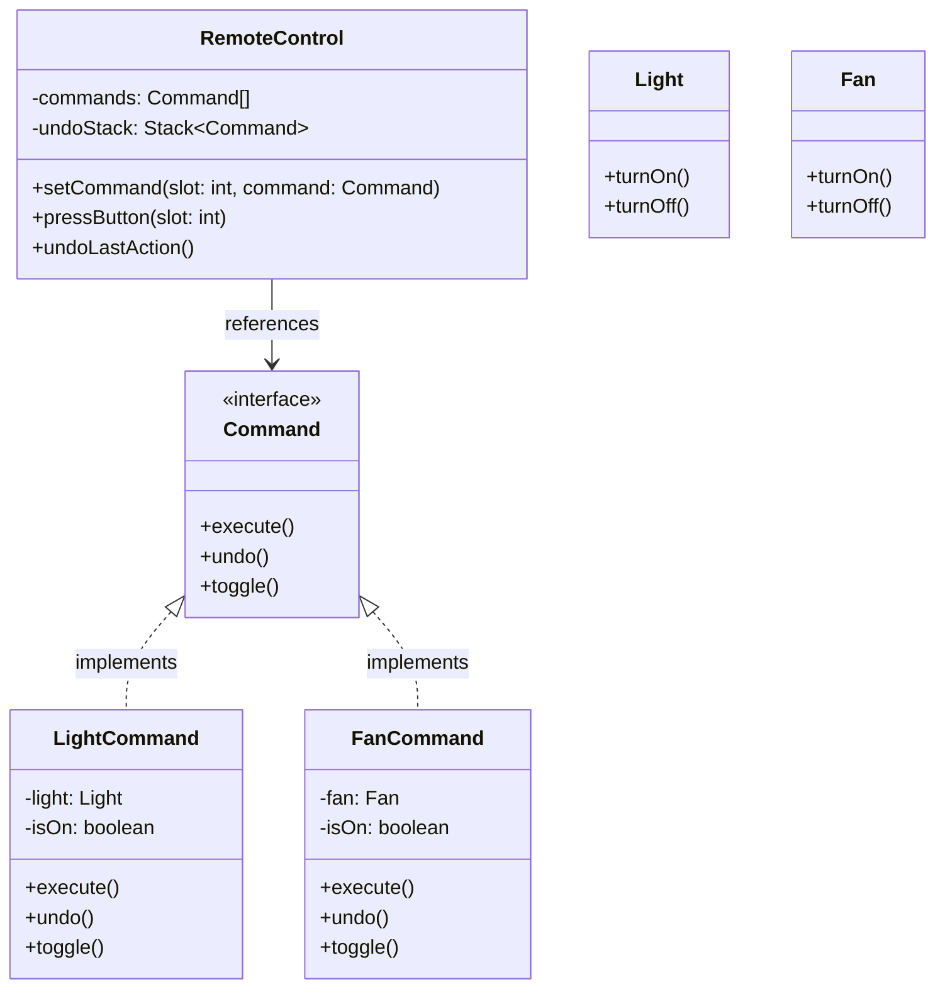

# Command Pattern

This directory contains two simple and classic command pattern scenarios:
- **Java**: Smart Home Remote Control (Device Actions with Undo)
- **Ruby**: Text Editor Undo/Redo (Document modifications using dynamic Command objects)

---

## Problem 1 (Java): Smart Home Remote Control

### Problem Description
Imagine we are designing a programmable **Smart Home Remote Control** (the *Invoker*). The remote control has slots/buttons that can be assigned to different commands representing appliances.

This implementation depicts how a **real toggle remote control** works. Instead of having separate "On" and "Off" buttons for each device, each slot toggles the device's state (ON/OFF) dynamically.

Our design supports:
- **Invoker (`RemoteControl`)**: Keeps track of configured commands (`Command[]`) and a history of executed commands in an `undoStack` (`Stack<Command>`) to support multi-level undo. It provides `setCommand(slot, command)` to configure commands, `pressButton(slot)` to trigger a toggle, and `undoLastAction()` to undo.
- **Command (`Command`)**: An interface that defines three behaviors: `execute()`, `undo()`, and `toggle()`.
- **Concrete Commands (`LightCommand`, `FanCommand`)**: Implement the `Command` interface. They keep track of their own state (`isOn: boolean`), hold references to their respective receivers (`Light`, `Fan`), and map actions to them.
- **Receivers (Appliances)**: Devices such as `Light` and `Fan` that perform the actual actions (`turnOn()` and `turnOff()`).

### Class Diagram

---

## Problem 2 (Ruby): Text Editor with Multi-Level Undo/Redo

### Problem Description
Implement a simple text formatting buffer/document editor that allows inserting text, deleting text, and reverting operations.
- The base receiver is a `Document` class that contains a string `@text`.
- Implement concrete command classes:
  1. `InsertTextCommand`: Appends a string to the document.
  2. `DeleteTextCommand`: Removes a specified number of characters from the end of the document.
- The invoker is a `TextEditor` which has a history stack for `undo` operations and a separate stack for `redo` operations.
- Since Ruby supports blocks and closures, explore how we can also implement commands dynamically using blocks/lambdas (e.g. `editor.execute { document.insert("text") }` with a corresponding undo block) instead of writing separate classes for every command.

---

### Constraints & Requirements
1. The code must be runnable in both Java and Ruby, with output showing how the pattern solves the problem.
2. For Java, implement `RemoteControl` tracking execution history using a `Stack` to support multi-level Undo.
3. For Ruby, demonstrate running commands, executing an undo, and executing a redo, showing the text buffer changes.

### Reflection: Java vs. Ruby
Compare the implementations:
- **Java**: How does the strong typing of interfaces shape the Command contract? How did you structure concrete command classes to track state needed for Undo?
- **Ruby**: How can closures (Blocks/Procs) or dynamic method dispatch simplify the Command pattern compared to Java's class-per-command approach?
