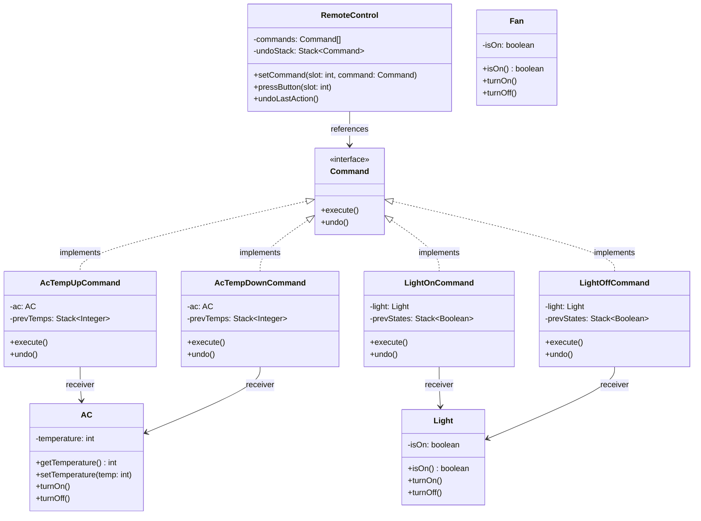

# Command Pattern

This directory contains two simple and classic command pattern scenarios:
- **Java**: Smart Home Remote Control (Device Actions with Undo)
- **Ruby**: Text Editor Undo/Redo (Document modifications using dynamic Command objects)

---

## Problem 1 (Java): Smart Home Remote Control

### Problem Description
Imagine we are designing a programmable **Smart Home Remote Control** (the *Invoker*). The remote control has slots/buttons that can be assigned to different commands representing actions on smart home devices.

This implementation demonstrates the **classic stateful-undo Command Pattern**. Each command captures the receiver's state before executing (such as AC temperature or light status) using an internal stack of previous states (`prevStates`/`prevTemps`). This allows the invoker to execute multi-level undo calls directly on the command objects.

Our design supports:
- **Invoker (`RemoteControl`)**: Holds an array of assigned commands (`commands: Command[]`) and a history stack of executed commands (`undoStack: Stack<Command>`). It provides `setCommand(slot, command)` to configure commands, `pressButton(slot)` to trigger execution, and `undoLastAction()` to pop the last command and invoke its `undo()` method.
- **Command Interface (`Command`)**: Defines `execute()` and `undo()`.
- **Concrete Commands (`AcTempUpCommand`, `AcTempDownCommand`, `LightOnCommand`, `LightOffCommand`, `FanOnCommand`, `FanOffCommand`)**: Implement `Command`. Commands maintain internal state stacks (`prevTemps` / `prevStates`) to preserve the receiver's prior state before each execution, enabling accurate multi-level undo restoration.
- **Receivers (Appliances)**: Devices such as `AC` (with temperature control), `Light`, and `Fan` that perform the actual actions (`turnOn()`, `turnOff()`, `setTemperature()`).

### Class Diagram

---

## Problem 2 (Ruby): Text Editor with Multi-Level Undo/Redo

### Problem Description
Implement a simple text formatting buffer/document editor that allows inserting text, deleting text, and reverting operations.
- The base receiver is a `Document` class that contains a string `@text`.
- Implement concrete command classes:
  1. `InsertTextCommand`: Appends a string to the document.
  2. `DeleteTextCommand`: Removes a specified number of characters from the end of the document.
- The invoker is a `TextEditor` which has a history stack for `undo` operations and a separate stack for `redo` operations.
- Since Ruby supports blocks and closures, explore how we can also implement commands dynamically using blocks/lambdas (e.g. `editor.execute { document.insert("text") }` with a corresponding undo block) instead of writing separate classes for every command.

---

### Constraints & Requirements
1. The code must be runnable in both Java and Ruby, with output showing how the pattern solves the problem.
2. For Java, implement `RemoteControl` tracking execution history using a `Stack` to support multi-level Undo.
3. For Ruby, demonstrate running commands, executing an undo, and executing a redo, showing the text buffer changes.

### Reflection: Java vs. Ruby
Compare the implementations:
- **Java**: How does the strong typing of interfaces shape the Command contract? How did you structure concrete command classes to track state needed for Undo?
- **Ruby**: How can closures (Blocks/Procs) or dynamic method dispatch simplify the Command pattern compared to Java's class-per-command approach?
