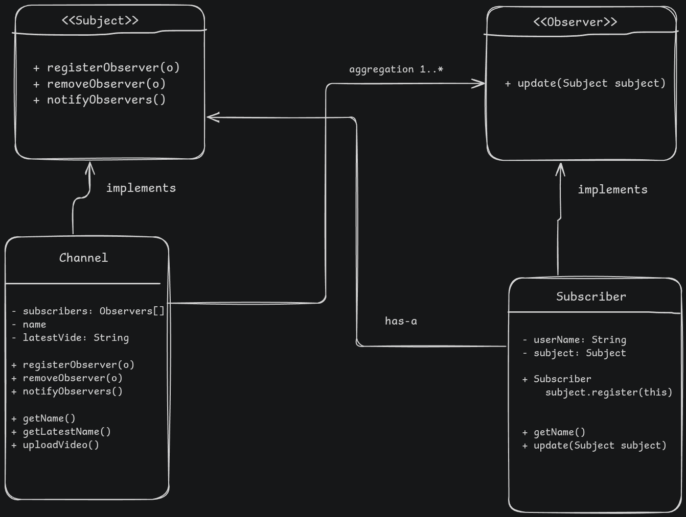

# Observer Pattern

This directory contains two simple and classic observer scenarios:
- **Java**: YouTube Channel Subscriber Notification
- **Ruby**: Social Media Feed Update Notification

---

## Problem 1 (Java): YouTube Subscriber Notification

### Problem Description
Implement a simple notification system mimicking YouTube subscribers.
- Create a `YoutubeChannel` class (the Subject) that maintains a list of subscribers.
- Create a `Subscriber` interface (the Observer) with an `update(String videoTitle)` method.
- When the channel uploads a new video via `uploadVideo(String title)`, it must automatically notify all registered subscribers with the title of the video.
- Test by registering multiple subscribers, uploading a video, unregistering a subscriber, and uploading another video.

---

## Problem 2 (Ruby): Social Media Feed Notification

### Problem Description
Implement a simple social media user feed update system.
- Create a `User` class (the Subject) who can publish posts.
- Followers (Observers) can follow users.
- When a user publishes a post via `publish_post(content)`, all of their followers should be notified, updating their local feeds or printing a notification to the console.
- In Ruby, implement this using a standard list of observer objects, or explore using block-based callbacks (e.g. `user.on_new_post { |post| ... }`).

---

### Constraints & Requirements
1. The code must be runnable with output showing how subscribers/followers are notified.
2. Ensure proper decoupling (Subject should not depend on concrete observer implementations).

### Reflection: Java vs. Ruby
Compare the implementations:
- **Java**: How did the use of interfaces help decouple the channel from subscribers?
- **Ruby**: How did dynamic typing or callbacks make subscribing/notifying simpler?
