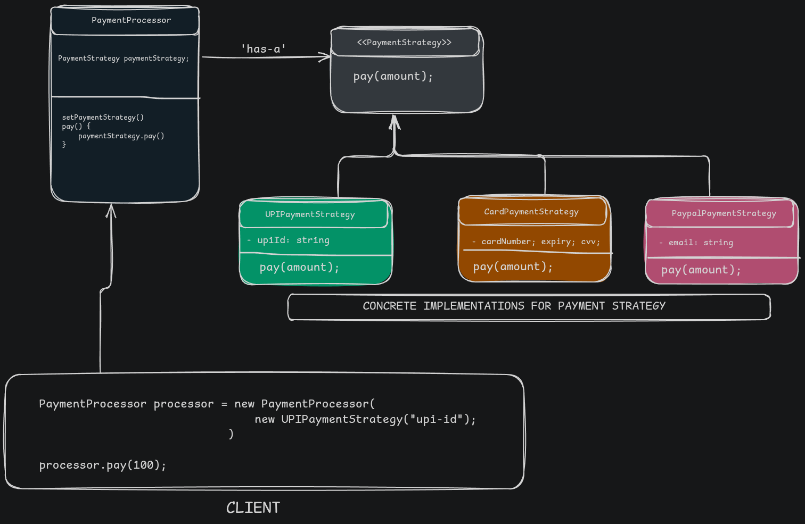

# Strategy Pattern

## Problem Identifier: Payment Processing

### Problem Description
Describe the design scenario here:
> A payment processing simulation or system that lets you choose between different payment strategies at run time.

### Class Diagram
<!-- Paste class diagram image here -->

### Constraints & Requirements
1. The code must be runnable with output showing how the pattern solves the problem.
2. New behaviors must be pluggable without modifying existing runner logic.

### Reflection: Java vs. Ruby
Compare the implementations:
- **Java**: 
- **Ruby**:
