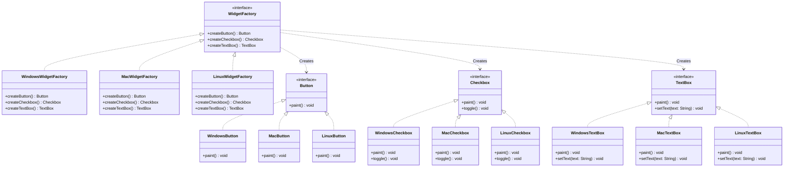

# Abstract Factory Pattern

## Problem Identifier: Cross-Platform UI Widget Toolkit

### Problem Description
You are building a cross-platform desktop UI library that must support rendering visual components (widgets) dynamically matching the style and theme of different host Operating Systems (e.g., **Windows**, **macOS**, **Linux**).

To maintain a consistent Look-and-Feel, the application must ensure that widgets from different OS themes are not mixed. For example, a **Windows Button** should never be paired with a **macOS Checkbox** inside the same session.

Using the **Abstract Factory** pattern:
1. Define abstract products for widgets: `Button`, `Checkbox`, and `TextBox`.
2. Implement concrete versions of each widget for each platform:
   * **Windows**: `WindowsButton`, `WindowsCheckbox`, `WindowsTextBox`
   * **macOS**: `MacButton`, `MacCheckbox`, `MacTextBox`
   * **Linux**: `LinuxButton`, `LinuxCheckbox`, `LinuxTextBox`
3. Define the abstract factory interface (`WidgetFactory`) with methods to create each widget type:
   * `createButton()`
   * `createCheckbox()`
   * `createTextBox()`
4. Implement concrete factories for each operating system: `WindowsWidgetFactory`, `MacWidgetFactory`, and `LinuxWidgetFactory`.

### Class Diagram

### Constraints & Requirements
1. The code must be runnable with output showing how the pattern solves the problem.
2. The client code should configure itself with a specific concrete factory instance at startup, and then build the interface using only the `WidgetFactory` interface and abstract product types.
3. Adding a new platform style (e.g., a "Web/Flat" theme) should only require creating a new factory subclass and implementing its matching set of widgets, without modifying the existing client or other widget code.

### Reflection: Java vs. Ruby
Compare the implementations:
- **Java**: 
- **Ruby**: 
