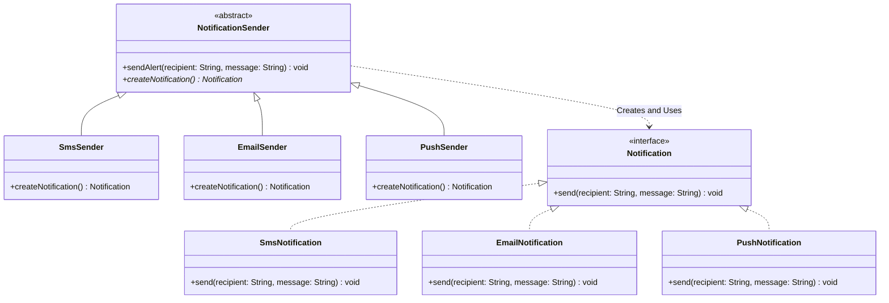

# Factory Method Pattern

## Problem Identifier: Omnichannel Notification Dispatcher

### Problem Description
A modern application needs a notification delivery system to alert users about system events. The application should support sending alerts through various channels, such as **SMS**, **Email**, and **Push Notifications**, based on user preference or network availability. 

The core application logic (the "Runner" or "Client") needs to trigger these alerts without hardcoding the details of how each message channel is constructed or initialized. Additionally, each notification channel requires different setup parameters or internal components (e.g., SMS requires a phone provider API client, Email requires SMTP credentials, Push requires a device registration service).

Using the **Factory Method** pattern:
1. Define a product interface for notifications (`Notification`).
2. Implement concrete notification types (`SmsNotification`, `EmailNotification`, `PushNotification`).
3. Define a creator class (`NotificationSender`) which includes:
   * A factory method `createNotification()` that returns a `Notification`.
   * A concrete method `sendAlert(String recipient, String message)` that uses the product returned by the factory method.
4. Implement concrete creators (`SmsSender`, `EmailSender`, `PushSender`) that override the factory method to return the appropriate notification instance.

### Class Diagram

### Constraints & Requirements
1. The code must be runnable with output showing how the pattern solves the problem.
2. The user selection of the notification channel should determine which sender class is instantiated, but the code triggering the notification should only interact with the `NotificationSender` and `Notification` abstractions.
3. Adding a new notification channel (e.g., Slack or Discord) must be possible by creating a new `NotificationSender` subclass and `Notification` implementation, without changing the existing sender implementations.

### Reflection: Java vs. Ruby
Compare the implementations:
- **Java**: 
- **Ruby**: 
