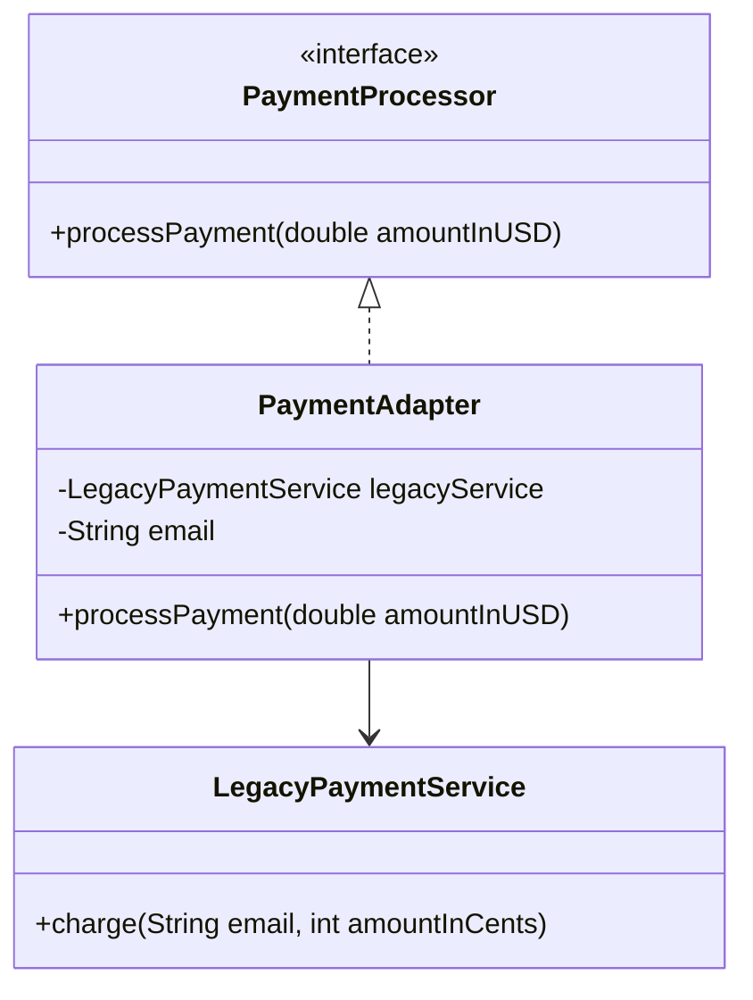

# Adapter Pattern

This directory contains two simple and classic adapter pattern scenarios:
- **Java**: Payment Gateway Adapter (Legacy USD to Cents Payment Processing)
- **Ruby**: Weather Service Adapter (Fahrenheit to Celsius conversion)

---

## Problem 1 (Java): Payment Gateway Adapter

### Problem Description
Your e-commerce application relies on a unified `PaymentProcessor` interface that expects payments to be processed via `processPayment(double amountInUSD)`. 

You want to integrate a third-party legacy payment system, `LegacyPaymentService`. However, this service has an incompatible interface: it charges users using the method `charge(String email, int amountInCents)`.

Since you cannot change the legacy service's source code, and you want to avoid altering the e-commerce client code that expects a `PaymentProcessor`, you need to build an adapter.

### Class Diagram

---

## Problem 2 (Ruby): Weather Service Adapter

### Problem Description
Imagine your application expects a unified `WeatherProvider` object that returns local temperature readings in Celsius using the method `temperature_in_celsius(city)`.

You want to integrate a third-party `FahrenheitWeatherService` that has a different method interface: it returns temperatures in Fahrenheit using `fetch_temperature(city_name)`.

Implement an adapter `WeatherAdapter` that implements or mimics the expected `WeatherProvider` interface by wrapping the `FahrenheitWeatherService`, converting the result from Fahrenheit to Celsius internally.

---

### Constraints & Requirements
1. The code must be runnable in both Java and Ruby, with output showing how the pattern solves the problem.
2. For Java, define the target interface `PaymentProcessor` and implement `PaymentAdapter` wrapping `LegacyPaymentService`.
3. For Ruby, show how you can implement the adapter using standard inheritance/composition or dynamically using Ruby's dynamic method lookup/duck typing without formal interfaces.

### Reflection: Java vs. Ruby
Compare the implementations:
- **Java**: How does the static compiler type contract affect adapter design?
- **Ruby**: How does duck typing allow us to build an adapter without inheriting from a strict target interface class?
