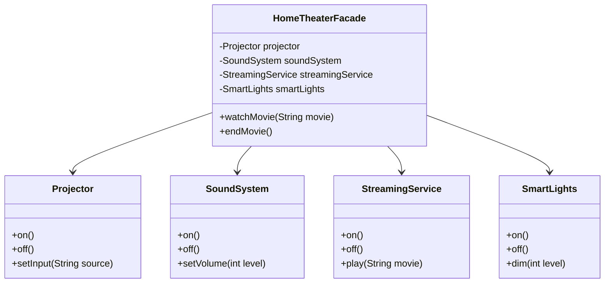

# Facade Pattern

This directory contains two simple and classic facade pattern scenarios:
- **Java**: Home Theater Facade (System Startup & Teardown orchestration)
- **Ruby**: Online Order Fulfillment Facade (E-commerce Checkout workflow coordination)

---

## Problem 1 (Java): Home Theater Facade

### Problem Description
You are setting up a home theater system. To watch a movie, you have to interact with several complex subsystems individually:
- Turn on the `Projector` and set input to "Streaming Service".
- Turn on the `SoundSystem`, set mode to "Surround Sound", and set volume to 20.
- Turn on the `StreamingService` and play a specific movie.
- Dim the `SmartLights` to 10% brightness.

To stop the movie, you have to reverse all these steps.

Writing this sequence in client code creates tight coupling to the individual subsystems. We need a simple, single interface (a `HomeTheaterFacade`) that handles all these operations with two simple methods: `watchMovie(String movieTitle)` and `endMovie()`.

### Class Diagram

---

## Problem 2 (Ruby): Online Order Fulfillment Facade

### Problem Description
In an e-commerce platform, completing a checkout requires coordinating several separate services:
- `PaymentProcessor`: Verifies customer balance and processes the credit card transaction.
- `InventoryService`: Checks item stock availability and reserves the physical item.
- `ShippingService`: Generates a shipping label and notifies the carrier.

To simplify the checkout process for the web controller (client), implement an `OrderFacade` class. The facade should expose a single, simple interface: `place_order(user_id, item_id, quantity)`. It coordinates the calls to all three subsystems behind the scenes and handles errors gracefully if any step fails (e.g. rolling back inventory reservation if payment fails).

---

### Constraints & Requirements
1. The code must be runnable in both Java and Ruby, with output showing how the facade simplifies client operations.
2. For Java, implement `HomeTheaterFacade` holding references to `Projector`, `SoundSystem`, `StreamingService`, `SmartLights`.
3. For Ruby, show how the `OrderFacade` coordinates checkouts and keeps the client controller clean and decoupled from internal warehouse services.

### Reflection: Java vs. Ruby
Compare the implementations:
- **Java**: How does the facade pattern hide the complexity of static subsystem objects?
- **Ruby**: How does the facade pattern help structure code in script/Rails environments? Can dynamic method forwarding (delegation) be useful in facades?
